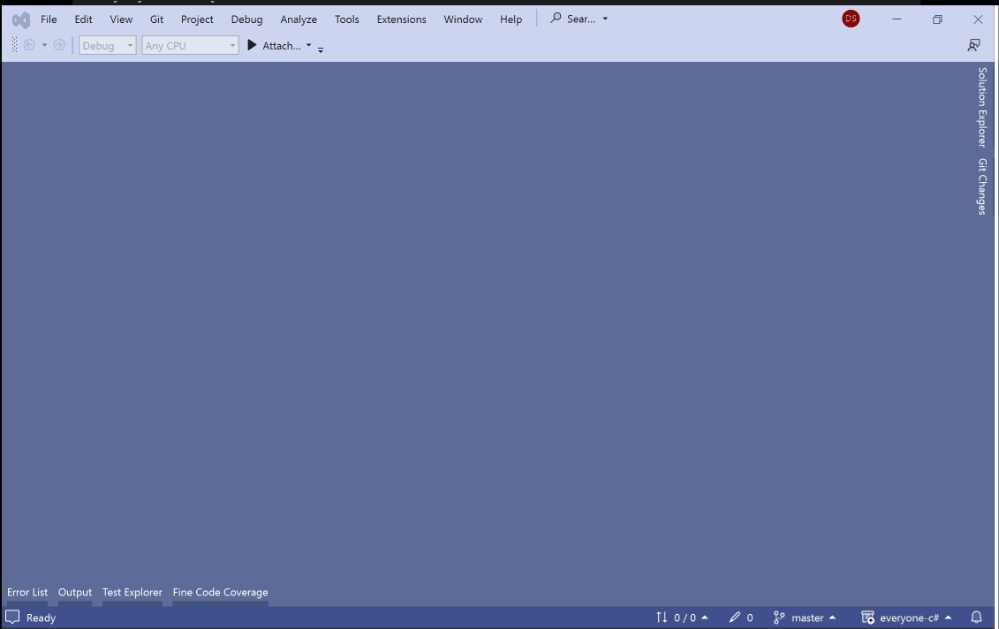
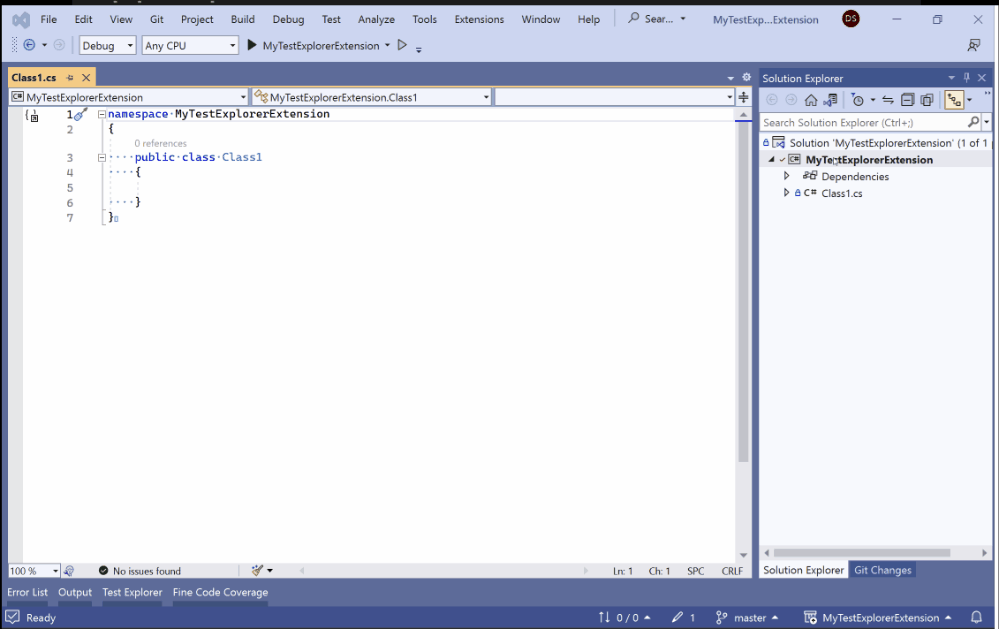

# Extending Visual Studio: Tests

## MSTest Framework

I've been using Java for my personal programming projects for several years. I recently got interested in some VR-style projects, so I finally decided to jump back on to the C#/.NET bandwagon so that I could use Unity to build my projects. I'm a big advocate for testing the code that you write. However, I've spent enough time working in C# projects (I worked at Microsoft for 9 years) to know that I hate the default MSTest/VSTest framework. In case you've never seen it before, this is how you'd define a test class and test method using MSTest:

```c#
using Microsoft.VisualStudio.TestTools.UnitTesting;

namespace everyone
{
    /// <summary>
    /// The TestClass attribute marks this class as a TestMethod container. If you don't have this
    /// attribute, then none of the TestMethod methods in this class will be discovered.
    /// </summary>
    [TestClass]
    public class MSTestExample
    {
        /// <summary>
        /// The TestMethod attribute marks this method as a test method that will be discovered and
        /// invoked by the MSTest test discoverer and executor.
        /// </summary>
        [TestMethod]
        public void MSTestExampleMethod()
        {
            Assert.IsTrue(false);
        }
    }
}
```

I have a few issues with this style of unit testing:

1. **Redundancy**: In order for a test method to be discovered, it's class must be marked with a [TestClassAttribute](https://learn.microsoft.com/en-us/dotnet/api/microsoft.visualstudio.testtools.unittesting.testclassattribute) and the test method must be marked with a [TestMethodAttribute](https://learn.microsoft.com/en-us/dotnet/api/microsoft.visualstudio.testtools.unittesting.testmethodattribute). I'm sure there's a performance reason here, but it's also unnecessary. From a usability standpoint, I should just have to mark the test with a [TestMethodAttribute](https://learn.microsoft.com/en-us/dotnet/api/microsoft.visualstudio.testtools.unittesting.testmethodattribute) and then the MSTest framework should discover and execute the test. Keep it simple and make it easier for people to fall into the pit of success.

2. **Magic Incantations**: When you first create a new MSTest project, a new C# class file is created for you that contains the [TestClassAttribute](https://learn.microsoft.com/en-us/dotnet/api/microsoft.visualstudio.testtools.unittesting.testclassattribute) and a method with the [TestMethodAttribute](https://learn.microsoft.com/en-us/dotnet/api/microsoft.visualstudio.testtools.unittesting.testmethodattribute). If you look at my MSTest example above, however, you'll notice that my test method has a reference to the [Assert](https://learn.microsoft.com/en-us/dotnet/api/microsoft.visualstudio.testtools.unittesting.assert) class. I'd say that most experienced developers probably know that if they just type in "Assert" into the text editor then the auto-completion system will help them to find the correct library and type for making assertions in their tests. If you're brand new at this, though, that might not be intuitive to you. I prefer that frameworks expose their functionality to me directly rather than hoping that I get lucky and find their magic static classes during my internet searching. Another quick example? How do you skip a test using the MSTest framework? The code example above gives no hints as to how you can do it. All the attributes in the example might make you think that MSTest could have a SkipAttribute or something like that? To be clear, this isn't a pit of success that we're falling into by making this guess. This is an experienced guess based on an observed pattern. If you type [Skip] above a test method, you'll just get a compiler error. The correct attribute is the [IgnoreAttribute](https://learn.microsoft.com/en-us/dotnet/api/microsoft.visualstudio.testtools.unittesting.ignoreattribute). If you know the right incantations, you can make magic happen. If you don't, then I hope your internet searching skills are up to the task (and that someone has written documentation for you to find. More on this later.).
3. **Test Names**: This one is less important, but I feel like it's worth bringing up. Since in this style of test framework the name of a test is tied to the method's name, you obviously can't have spaces or use real sentences to describe your test. This leads to tests using either camel-case (`myTestMethod()`) or Pascal-case (`MyTestMethod()`), of the two Pascal-case is the conventional option in the C#/.NET world. It's a minor annoyance, but it does lead to headaches, especially if I'm writing any tests that have HTTP in the name.

I have other gripes about the MSTest framework, but I'll leave it at that for now.

## Everyone Test Framework

Software development is amazing because it's all just code. If you don't like the framework that is default, you're free to build your own. So, that's what I did.

Here's what the Everyone Test framework looks like:

```c#
namespace everyone
{
    public static class Class1
    {
        public static void Test(TestRunner runner)
        {
            runner.TestGroup(typeof(Class1), () =>
            {
                runner.Test("passing test", (Test test) =>
                {
                    test.AssertEqual(1, 1);
                });

                runner.Test("failing test", (Test test) =>
                {
                    test.Fail("error message");
                });
            });
        }
    }
}
```

I have a couple of concessions to make here. First of all, yes, I know that the `public static void Test(TestRunner)` method signature is a magical incantation. There's got to be some type of entry point into a test class, and this was the one that I like the best. You may also be thinking, "Geez, that's a pretty noisy class with a bunch of lambdas in there." Yup, this test framework uses a lot of lambdas. I picked up this style when I used the Javascript testing framework [Mocha](https://mochajs.org/) and I really liked it. Unfortunately, I feel like [Mocha](https://mochajs.org/) has a bit too much magic to it, so I modified its style a little for my purposes. Okay, concessions out of the way, let's talk about this framework.

If you're using a text editor with auto-completion functionality, then once you know to write a method with the `public static void Test(TestRunner)` signature, the auto-completion functionality will walk you through the rest of what you need to do. [TestRunner](https://github.com/danschultequb/everyone-csharp/blob/master/lib-c%23/TestRunner.cs) only has methods for creating [TestGroup](https://github.com/danschultequb/everyone-csharp/blob/master/lib-c%23/TestGroup.cs)s and [Test](https://github.com/danschultequb/everyone-csharp/blob/master/lib-c%23/Test.cs)s. Once you get inside of a lambda with access to a [Test](https://github.com/danschultequb/everyone-csharp/blob/master/lib-c%23/Test.cs) object, the [Test](https://github.com/danschultequb/everyone-csharp/blob/master/lib-c%23/Test.cs) object provides all of the assertion methods that you need. The type/auto-completion system teaches you how to use the framework, just like it should.

I got this basic framework up and running within a day or two and was writing tests for my code. The biggest challenge was that I was running these tests in a console application (see [ConsoleTestRunner](https://github.com/danschultequb/everyone-csharp/blob/master/lib-c%23/ConsoleTestRunner.cs) for an implementation that runs tests and writes the results to the console) because it's was the easiest way to get started. However, I knew that if I really wanted to work more efficiently, I needed to integrate my test framework with [Visual Studio's Test Explorer](https://learn.microsoft.com/en-us/visualstudio/test/run-unit-tests-with-test-explorer). How hard could that be? Turns out, pretty hard.

## Documentation? What Documentation?

If you wanted to integrate your test framework into [Visual Studio's Test Explorer](https://learn.microsoft.com/en-us/visualstudio/test/run-unit-tests-with-test-explorer), what would you search for on the internet? How about "how to extend Visual Studio Test Explorer"? Or maybe even "visual studio test explorer extensibility"? The results of both of those queries are more than happy to teach you how to use Test Explorer, but nothing about how to extend it to use your stuff. You may get lucky and find the [vstest](https://github.com/microsoft/vstest) GitHub repository, but the documents in there are mostly proposals/RFCs and explanations of architecture. There's a little bit of help when it starts talking about [ITestDiscoverer](https://github.com/microsoft/vstest/blob/main/src/Microsoft.TestPlatform.ObjectModel/Adapter/Interfaces/ITestDiscoverer.cs) and [ITestExecutor](https://github.com/microsoft/vstest/blob/main/src/Microsoft.TestPlatform.ObjectModel/Adapter/Interfaces/ITestExecutor.cs), but I still had plenty of searching around to do before I was able to get my tests running in Test Explorer. Let's get down to the real purpose of this article now. What is the simplest way to get your tests running in Visual Studio's Test Explorer?

## Preparation

Just in case you don't already have it installed, you'll need Visual Studio to follow these instructions. You can pick up the Community (aka Free) edition [here](https://visualstudio.microsoft.com/vs/community/). When you have to pick workloads to install, you'll only need the .NET Desktop Development workload.

## Project Setup

Now that you have Visual Studio setup with the correct workload, let's create our Test framework. Start by creating a new C# Class Library project:



1. From the top-level menu, click on File -> New Project.
2. Select "C# Class Library" as the type of the project.
3. Give it any project name you want.
4. The default .NET target (7.0 in this case) is fine.

Once the project is created, we now to need to install the [Microsoft.TestPlatform.ObjectModel](https://www.nuget.org/packages/Microsoft.TestPlatform.ObjectModel) NuGet package to get access to the types that will allow us to integrate with Test Explorer.



1. Right-click on the project node in the "Solution Explorer".
2. Click "Manage NuGet Packages".
3. Click on the "Browse" text/tab in the page that opens up.
4. Enter "Microsoft.TestPlatform.ObjectModel" into the search box.
5. Choose the option that has a blue check mark next to it.
6. Click on the "Install" button to the right (the latest stable version will be just fine).